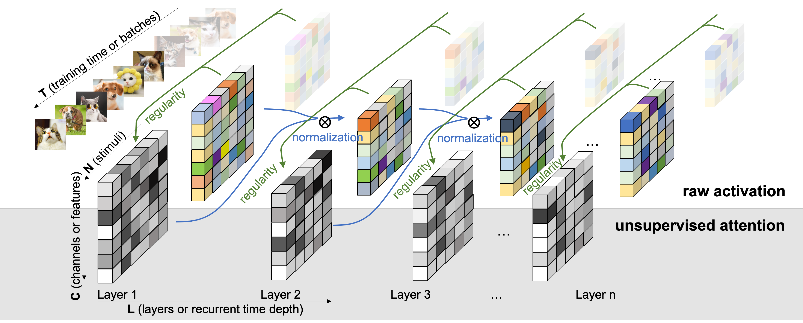

# Unsupervised Attention Mechanism (UAM)

 

Code for our paper published on *Entropy*: 

**"Regularity Normalization: Neuroscience-Inspired Unsupervised Attention across Neural Network Layers"** 

by [Baihan Lin](http://www.columbia.edu/~bl2681/) (Columbia). 

For the latest full paper: https://arxiv.org/abs/1902.10658

All the experimental results and analysis can be reproduced using the code in this repository. Feel free to contact me by doerlbh@gmail.com if you have any question about our work.

**Abstract**

Inspired by the adaptation phenomenon of neuronal firing, we propose the regularity normalization (RN) as an unsupervised attention mechanism (UAM) which computes the statistical regularity in the implicit space of neural networks under the Minimum Description Length (MDL) principle. Treating the neural network optimization process as a partially observable model selection problem, the regularity normalization constrains the implicit space by a normalization factor, the universal code length. We compute this universal code incrementally across neural network layers and demonstrate the flexibility to include data priors such as top-down attention and other oracle information. Empirically, our approach outperforms existing normalization methods in tackling limited, imbalanced and non-stationary input distribution in image classification, classic control, procedurally-generated reinforcement learning, generative modeling, handwriting generation and question answering tasks with various neural network architectures. Lastly, the unsupervised attention mechanisms is a useful probing tool for neural networks by tracking the dependency and critical learning stages across layers and recurrent time steps of deep networks.

## Info

Language: Python3, bash

Platform: MacOS, Linux, Windows

by Baihan Lin, Feb 2019

## Citation

If you find this work helpful, please try the models out and cite our work. Thanks!

    @article{lin2022regularity,
      title={Regularity Normalization: Neuroscience-Inspired Unsupervised Attention across Neural Network Layers},
      author={Lin, Baihan},
      journal={Entropy},
      volume={24},
      year={2022},
      number={1},
      pages={59},
      article-number={59},
      doi={10.3390/e24010059},
      url={https://www.mdpi.com/1099-4300/24/1/59},
      issn={1099-4300},
    }

  

An earlier version of the work was also presented at the IJCAI 2019 Workshop on Human Brain and Artificial Intelligence in Macau, China. See the slides [here](https://www.baihan.nyc/pdfs/IJCAI_RN_slides.pdf) (with only partial results, unlike the full extended journal referenced above).

## Tasks

* Imbalanced MNIST task with FFNN and RNN
* OpenAI gym's LunarLander-v2 game with DQN
* OpenAI gym's CarPole-v0 game with DQN
* MiniGrid gym's RedBlueDoors with PPO
* Handwritten digit generative modeling with DRAW
* Facebook AI's bAbI reasoning task 18 and 19 with GGNN

## Requirements

* Python 3
* [PyTorch](http://pytorch.org/)
* numpy and scikit-learn

## Acknowledgements

For the MiniGrid, Generative modeling, and bAbI tasks, this repository built upon the following repositories.   Thank you!

- https://github.com/lcswillems/rl-starter-files
- https://github.com/chingyaoc/ggnn.pytorch
- https://github.com/chenzhaomin123/draw_pytorch

